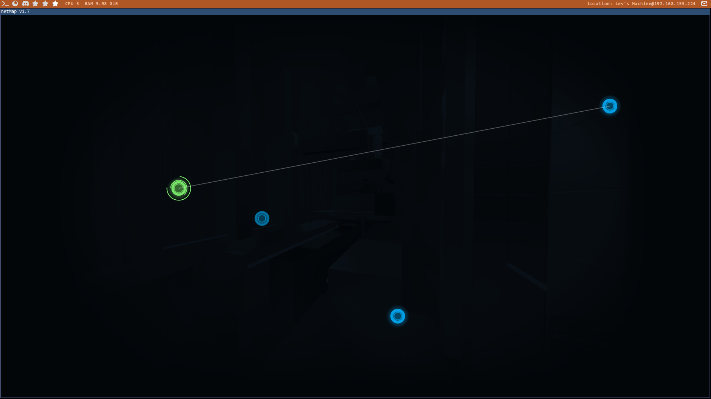

# Netmap
A replica of Netmap v1.7 from [Hacknet](https://store.steampowered.com/app/365450/hacknet/)

## Features
* Parsing SSH known_hosts file
* Change color theme

## Configuration
* Configuration file is located in ~/.config/netMap/config.yml
* Nodes are located in ~/.config/netMap/nodes.yml
